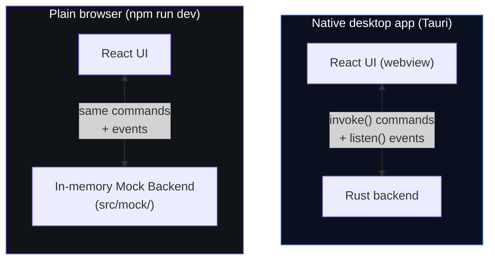
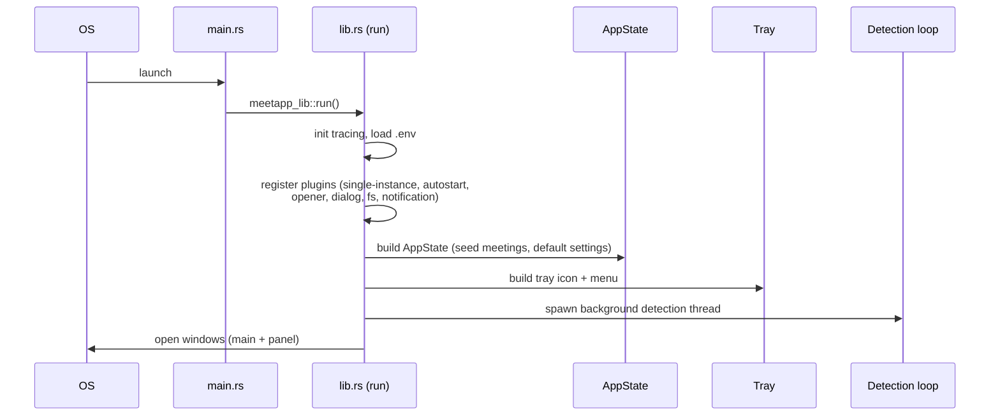
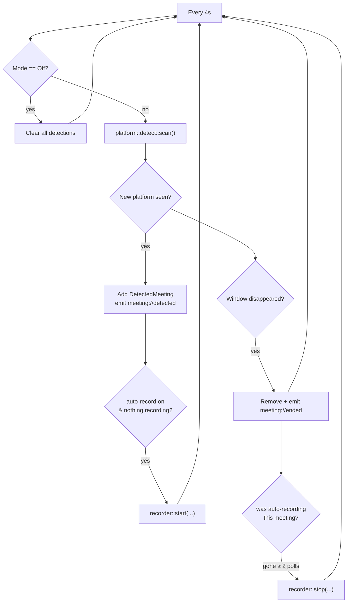
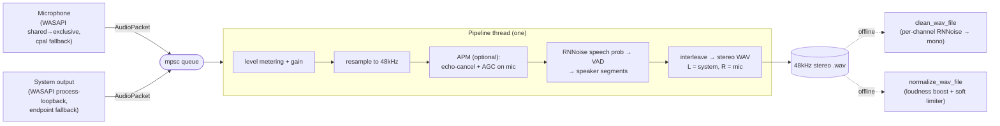
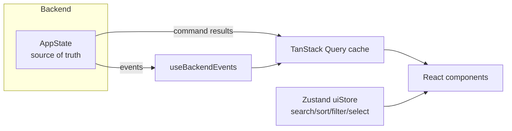

# MeetApp — Developer Documentation

> A guided tour of the whole codebase for a developer who has never seen it before.
> Read this top-to-bottom once, and you'll know where everything lives and why.

---

## 1. What is MeetApp?

MeetApp is a **desktop meeting assistant** (like Granola, Fireflies.ai, or Otter). It runs
quietly in your system tray, notices when you join a meeting on **Google Meet, Zoom,
Microsoft Teams, Discord, Slack Huddles, or Webex**, and can **record** the audio (and
optionally the screen), then produce a **transcript**, an **AI summary**, and **action
items**.

It is a **single desktop app** built with two halves that talk to each other:

| Half | Technology | Job |
| --- | --- | --- |
| **Frontend** (the UI) | React + TypeScript + Tailwind + Vite | Everything you see: windows, buttons, lists, the meeting detail page. |
| **Backend** (the engine) | Rust, packaged by **Tauri v2** | Everything that touches the machine: detecting meetings, capturing audio, writing files, calling cloud AI. |

Because it's built with **Tauri**, the whole thing ships as one small native app — the
React UI runs inside a system webview (Chromium on Windows), and the Rust code runs as a
normal native process. There is **no web server** and **no separate database**.

> **Important scoping facts (by design):**
> - **No database.** All app state lives in memory and is lost when you quit. (See §9.)
> - **No user accounts / login.** The only "credentials" are optional cloud-AI API keys. (See §10.)
> - **Windows is the first-class target.** macOS support is stubbed out but not implemented.

---

## 2. The big picture

There are really **three ways the UI can run**, and understanding this is the key to the
whole architecture:



The React UI **never talks to Tauri directly**. It always goes through a thin **bridge**
(`src/lib/tauri.ts`). At runtime the bridge asks one question — *"am I inside Tauri?"* —
and routes accordingly:

- **Inside the native app** → forward to the real Rust backend over Tauri IPC.
- **In a normal browser** → forward to a fake **mock backend** written in TypeScript that
  behaves exactly like the real one.

This is why you can develop the entire UI in a browser (`npm run dev`) with fake meetings,
fake detection, and a fake live-recording animation — no Rust build required — and the
exact same code runs unchanged in the shipped app.

### The contract that keeps both sides honest

The frontend and backend agree on three things, and if you change one you must change the
matching side:

1. **Commands** — functions the UI calls (e.g. `get_meetings`, `start_capture`). Defined
   in Rust with `#[tauri::command]`, listed in the typed façade `src/lib/api.ts`.
2. **Events** — messages the backend pushes to the UI (e.g. `recorder://status`). Defined
   in `src-tauri/src/events.rs`, typed in `src/types/index.ts` as `AppEvents`.
3. **Data types** — the shapes passed back and forth. Rust structs in
   `src-tauri/src/models/` use `#[serde(rename_all = "camelCase")]` so they serialize to
   the exact same field names as the TypeScript interfaces in `src/types/index.ts`.

> **Rule of thumb:** `src/types/index.ts` (TypeScript) and `src-tauri/src/models/` (Rust)
> are two views of the *same* data. Keep them in sync.

---

## 3. Technology stack

**Frontend**
- **React 18** + **TypeScript** — UI.
- **Vite 6** — dev server & bundler (fixed port `1420`, required by Tauri).
- **Tailwind CSS v4** + **shadcn-style** components built on **Radix UI** primitives (`src/components/ui/`).
- **Framer Motion** (`motion`) — animations.
- **TanStack Query** — server-state cache (meetings, settings, recorder status). See §8.
- **Zustand** — small client-only UI state (search box, sort, multi-select). See §8.
- **React Router** (`HashRouter`) — screen routing.

**Backend**
- **Rust** + **Tauri v2** — native shell, IPC, tray, windows, plugins.
- **cpal** — cross-platform microphone capture.
- **windows-rs (WASAPI)** — Windows mic + system-audio (loopback) capture.
- **hound** — WAV file read/write.
- **nnnoiseless** (RNNoise) — AI noise suppression + voice-activity detection.
- **sysinfo** + Win32 window titles — meeting detection.
- **ureq** — HTTP client for cloud AI (AssemblyAI, Groq).
- Optional: **windows-capture** (screen video), **whisper-rs** (on-device transcription),
  **webrtc-audio-processing** (echo cancellation / AGC).

---

## 4. Repository layout (the map)

```
sample1/
├── index.html                  # Vite entry; loads src/main.tsx
├── package.json                # JS deps + scripts (dev, app:dev, app:build)
├── vite.config.ts              # Vite config (port 1420, @ alias → src/)
├── tsconfig.json               # TypeScript config
├── components.json             # shadcn component generator config
├── .env / .env.example         # Cloud-AI API keys (loaded at startup)
│
├── src/                        # ── FRONTEND (React, platform-independent) ──
│   ├── main.tsx                # React root
│   ├── App.tsx                 # Providers + router + per-window routing
│   ├── index.css               # Tailwind + theme tokens
│   ├── types/index.ts          # Shared TS types (mirror Rust models)
│   ├── lib/                    # Bridge, API façade, query client, helpers
│   ├── hooks/                  # Query hooks + event→cache bridge + theme
│   ├── stores/                 # Zustand UI store
│   ├── mock/                   # In-memory fake backend (browser dev)
│   ├── layouts/                # MainLayout (title bar + nav rail)
│   ├── components/             # TitleBar, RecorderStatusPill, ui/ primitives
│   └── features/               # The actual screens:
│       ├── panel/              #   tray control popover
│       ├── meetings/           #   meetings list
│       ├── meeting-detail/     #   one meeting (transcript, summary, player…)
│       └── settings/           #   settings page
│
└── src-tauri/                  # ── BACKEND (Rust) ──
    ├── Cargo.toml              # Rust deps + feature flags
    ├── tauri.conf.json         # Windows, CSP, bundle config
    ├── capabilities/           # Tauri v2 permission grants
    ├── build.rs                # Tauri build script
    ├── examples/audio_diag.rs  # Standalone audio diagnostics tool
    └── src/
        ├── main.rs             # Thin launcher → lib::run()
        ├── lib.rs              # App setup: plugins, state, tray, detection
        ├── state.rs            # In-memory AppState + seed meetings
        ├── error.rs            # AppError type
        ├── events.rs           # Typed event emitters
        ├── dotenv.rs           # Minimal .env loader
        ├── recorder.rs         # Standalone cpal recorder (legacy commands)
        ├── tray.rs             # System tray icon + menu
        ├── models/             # Data types (Meeting, Settings, Recorder…)
        ├── commands/           # Tauri command handlers (the API)
        ├── core/               # Platform-INDEPENDENT domain logic
        │   ├── detection/      #   background meeting-detection loop
        │   ├── recorder/       #   capture orchestration + finalize
        │   ├── transcription/  #   Transcriber trait (+ whisper)
        │   ├── ai/             #   Summarizer trait (heuristic)
        │   └── cloud/          #   AssemblyAI + Groq
        ├── audio/              # Audio capture → processing → WAV pipeline
        │   ├── denoise.rs      #   RNNoise noise suppression (Denoiser trait)
        │   └── deepfilter.rs   #   Optional DeepFilterNet pre-transcription stage
        └── platform/           # Platform-SPECIFIC code (isolated)
            ├── detect.rs       #   detection facade
            ├── screen.rs       #   screen-capture facade
            ├── windows/        #   real Windows implementations
            └── macos/          #   stubs for a future release
```

**Two golden organizing principles:**

1. **`core/` is platform-independent; `platform/` is platform-specific.** Anything that
   would differ between Windows and macOS lives behind a small **facade** in `platform/`
   (e.g. `platform::detect::scan()`). The rest of the app never uses `#[cfg(windows)]`
   directly. Adding macOS = implement two facades; nothing in `core/`, `commands/`, or the
   UI changes.
2. **The UI is organized by *feature*, not by file type.** Each screen owns its folder
   under `src/features/`.

---

## 5. The API surface (commands & events)

This is the contract from §2, spelled out. These are "APIs" in the local-IPC sense — there
is no HTTP server; the UI calls Rust functions by name.

### 5a. Commands (UI → backend, request/response)

Every command is exposed by the typed façade in [`src/lib/api.ts`](src/lib/api.ts). UI code
calls `api.xxx()`, never `invoke()` directly.

| `api` method | Rust command | What it does |
| --- | --- | --- |
| `listMeetings()` | `get_meetings` | All meetings, newest first. |
| `getMeeting(id)` | `get_meeting` | One meeting (or null). |
| `getSettings()` | `get_settings` | Current settings. |
| `updateSettings(patch)` | `update_settings` | Patch one or more settings fields. |
| `getRecorderStatus()` | `get_recorder_status` | Live recorder status snapshot. |
| `getDetectedMeetings()` | `get_detected_meetings` | Meetings the detector currently sees. |
| `setMode(mode)` | `set_mode` | Set capture mode (off/transcribe/record/recordVideo). |
| `startCapture(opts)` | `start_capture` | Start recording (manual "Record Live"). |
| `stopCapture()` | `stop_capture` | Stop & finalize the active recording. |
| `setInputGain(gain)` | `set_input_gain` | Change capture volume live (mid-recording). |
| `captureDetected(id)` | `capture_detected` | Start recording a detected meeting. |
| `dismissDetected(id)` | `dismiss_detected` | Ignore a detection. |
| `sendBot(url)` | `send_bot` | (Stub) dispatch a meeting bot. |
| `toggleFlag(id, flag)` | `toggle_meeting_flag` | Toggle locked/starred/bookmarked. |
| `renameMeeting(id, title)` | `rename_meeting` | Rename a meeting. |
| `updateActionItem(...)` | `update_action_item` | Check/uncheck an action item. |
| `deleteMeeting(id)` | `delete_meeting` | Delete a meeting. |
| `transcribeMeeting(id)` | `transcribe_meeting` | Transcribe via AssemblyAI (async). |
| `summarizeMeeting(id)` | `summarize_meeting` | Summarize via Groq (or local fallback). |
| `enhanceMeetingAudio(id)` | `enhance_meeting_audio` | Loudness-normalize the saved WAV. |
| `cleanMeetingAudio(id)` | `clean_meeting_audio` | RNNoise-clean the saved WAV. |
| `openRecordingsFolder()` | `open_recordings_folder` | Open the save folder in Explorer. |
| `audioHealth()` | `audio_health` | Probe Windows shared-mode audio health. |
| `repairAudio()` | `repair_audio` | One-click repair of broken audio (elevated). |
| `openSoundSettings()` | `open_sound_settings` | Open the classic Windows Sound panel. |

All commands are registered in [`src-tauri/src/lib.rs`](src-tauri/src/lib.rs) via
`tauri::generate_handler![...]` and implemented in
[`src-tauri/src/commands/mod.rs`](src-tauri/src/commands/mod.rs).

### 5b. Events (backend → UI, push)

Defined in [`src-tauri/src/events.rs`](src-tauri/src/events.rs), typed in
[`src/types/index.ts`](src/types/index.ts) (`AppEvents`), and consumed in
[`src/hooks/useBackendEvents.ts`](src/hooks/useBackendEvents.ts).

| Event | Payload | UI reaction |
| --- | --- | --- |
| `recorder://status` | `RecorderStatus` | Overwrite the cached recorder status (drives meters, timer, pill). |
| `recorder://transcript` | `{ meetingId, segment }` | Append a live transcript segment. |
| `meeting://detected` | `DetectedMeeting` | Invalidate the detections query. |
| `meeting://ended` | `{ id }` | Invalidate the detections query. |
| `meeting://updated` | `Meeting` | Overwrite that meeting in cache + refresh the list. |

> **Key insight:** the UI **does not poll**. Live updates are **push-based** via events
> that write straight into the TanStack Query cache. This one mechanism powers the live
> meters, the elapsed timer, detection cards, and the streaming transcript.

---

## 6. Data types (the shared vocabulary)

These appear on both sides. The canonical list is
[`src/types/index.ts`](src/types/index.ts); the Rust mirror is
[`src-tauri/src/models/`](src-tauri/src/models/).

- **`Meeting`** — the central record: id, title, platform, mode, status, timestamps,
  duration, flags (locked/starred/bookmarked), tags, participants, timeline markers,
  transcript, summary, action items, and on-disk `audioPath`/`videoPath`.
- **`CaptureMode`** — `off | transcribe | record | recordVideo`.
- **`MeetingStatus`** — `live | processing | ready | failed` (lifecycle of a stored meeting).
- **`RecorderState`** — `idle | armed | detecting | recording | processing | error`
  (lifecycle of the recorder engine itself).
- **`RecorderStatus`** — live snapshot: state, mode, active meeting id, elapsed seconds,
  mic/system levels (0..1), input gain, `audioReady`, and an optional user-facing `message`.
- **`DetectedMeeting`** — a meeting the detector believes is in progress right now.
- **`Settings`** — all preferences (default mode, auto-record, capture-system-audio,
  noise-cancel toggles, startup options, save directory, theme, and cloud API keys).
- **`TranscriptSegment`, `Participant`, `MeetingSummary`, `ActionItem`, `TimelineMarker`**
  — the sub-parts of a meeting.
- **`AudioHealth`** — result of the Windows audio-engine probe (see §7f).

---

## 7. How the major features work (data-flow walkthroughs)

### 7a. Startup



`main.rs` is a one-liner that calls `lib.rs::run()`. `run()` does all setup: logging,
`.env` loading, Tauri plugins, building the shared `AppState`, the system tray, and
launching the background **detection loop**. Two windows open: **`main`** (the full app,
opens on the meetings list) and **`panel`** (the compact tray popover, hidden until
summoned). Closing a window **hides it to the tray** instead of quitting — the app only
exits via the tray's **Quit**.

### 7b. Two windows, one React app

Both windows load the **same** React bundle. `App.tsx` uses `HashRouter` and a small
`useWindowRouting` hook that asks Tauri for the current window's **label**:

- label `"main"` → route to `/app/meetings` (full app with nav rail).
- label `"panel"` (or `/`) → render `PanelPage` (the tray popover).

### 7c. Meeting detection (the background watcher)

A dedicated thread ([`core/detection/mod.rs`](src-tauri/src/core/detection/mod.rs)) polls
**every 4 seconds**:



`scan()` is the **facade**. On Windows it (a) lists running processes with `sysinfo` and
(b) enumerates visible window titles via Win32 `EnumWindows`, then **classifies** each
title against a platform (e.g. a title containing "zoom meeting" **and** a running `zoom`
process → Zoom). Cross-checking the title against a live process cuts false positives. It
returns at most one candidate per platform.

If **Auto-record detected** is on (default) and nothing else is recording, detection
immediately starts a capture. Conversely, when a meeting the app auto-started recording
for disappears for **≥ 2 consecutive polls (~8 s)**, the detection loop **auto-stops** that
recording (the grace period debounces transient detection drops, e.g. switching browser
tabs, so a recording isn't cut short). Manual "Record Live" sessions have no source
detection and keep running until you stop them.

### 7d. The recording lifecycle (start → stop → finalize)

This is the heart of the app. Orchestrated by
[`core/recorder/mod.rs`](src-tauri/src/core/recorder/mod.rs).

```mermaid
sequenceDiagram
    participant UI
    participant Cmd as start_capture
    participant Rec as core::recorder
    participant Audio as audio::Recorder
    participant Loop as capture thread
    participant Fin as finalize thread

    UI->>Cmd: startCapture()
    Cmd->>Rec: start(title, platform, mode)
    Rec->>Audio: Recorder::start(path, system?, gain)
    Audio-->>Rec: handle (mic + system threads + pipeline)
    Rec->>Loop: spawn capture loop (250ms tick)
    Rec-->>UI: emit recorder://status (Recording)
    loop every 250ms
        Loop-->>UI: recorder://status (levels, elapsed, audioReady)
    end
    UI->>Rec: stopCapture()
    Rec->>Audio: stop() → finalize WAV, return speaker segments
    Rec-->>UI: meeting://updated (status = Processing)
    Rec->>Fin: spawn finalize thread
    Fin->>Fin: clean (RNNoise) + normalize (loudness) the WAV
    alt Transcribe mode
        Fin->>Fin: AssemblyAI transcribe, delete temp audio
    else Record / RecordVideo
        Fin->>Fin: mark Ready
    end
    Fin-->>UI: meeting://updated (status = Ready)
```

Key behaviors to know:

- **Audio is captured for every mode except `off`.** `transcribe` mode writes to a
  **temporary** WAV that is **deleted** after transcription (no audio is retained);
  `record`/`recordVideo` keep the file under the save directory.
- The **capture loop** ticks every 250ms to push live `recorder://status` (mic/system
  levels, elapsed seconds, and `audioReady`). `audioReady` flips true only once real audio
  flows — the UI shows "Getting audio…" until then.
- On **stop**, the WAV is finalized and VAD **speaker segments** produce a baseline
  participant list ("You" / "Remote").
- **Finalize runs off-thread** so the UI returns instantly. It always **cleans then
  normalizes** the audio before playback, which is why the detail page holds audio as
  "processing" until the meeting is `Ready` — the file you hear is the corrected one.
- Live mid-recording controls: **input gain** (`set_input_gain`) is shared with the audio
  pipeline via an atomic and applied to every buffer.

### 7e. The audio pipeline (inside `audio::Recorder`)

All audio stays in Rust. Two capture threads feed **one** processing thread through a
shared queue:



- **Recording format:** 48 kHz, 16-bit, **stereo**, where **left channel = system audio
  ("Remote")** and **right channel = mic ("You")**. Keeping them separate lets the cleaner
  denoise each side independently.
- **VAD (voice activity detection)** uses RNNoise's trained *speech probability* (not just
  loudness), so it fires on speech and stays quiet for music/typing/hum. Its output becomes
  the baseline **participant talk-time** list.
- **APM** (WebRTC echo-cancel/AGC) is an **optional** mic-only stage (Cargo feature `apm`).
  When absent, the mic passes through and RNNoise is the noise-suppression fallback.
- **Offline passes** (run at finalize, or on demand via the detail page):
  - `clean_wav_file` — per-channel RNNoise noise cancellation, driven by the two settings
    toggles ("cancel my noise" → mic, "cancel others' noise" → system), then mixed to mono.
    The **mic** side additionally gets a **speech-probability residual gate** (a downward
    expander using RNNoise's own VAD to pull down noise-only gaps between words, with a
    floor + attack/release so it stays natural). The **far-end** is RNNoise-only — no gate —
    because it may be music or several remote speakers a single-speaker gate would damage.
  - `normalize_wav_file` — measures RMS and applies one boost gain (capped, boost-only)
    with a `tanh` soft limiter so quiet recordings become audible without clipping.

### 7f. Windows audio "repair" (a real-world gotcha)

Some Windows PCs have a broken audio **enhancement** (an *Audio Processing Object*) wired
into the shared-mode path. When it misbehaves, **every** app's shared-mode audio init
fails — Zoom, Teams, and MeetApp alike — while exclusive mode still works.

- `audio_health` (`platform/windows/audio_repair.rs::probe`) tests shared vs exclusive
  init **without changing anything** and reports an `AudioHealth`.
- `repair_audio` builds a PowerShell script that sets the `DISABLE_SYSFX` registry value on
  the default endpoints and restarts Windows Audio, launched **elevated via UAC**
  (reversible, installs nothing).
- `open_sound_settings` opens the classic Sound control panel for a manual fix.
- The Settings page's **Audio troubleshooting** card surfaces all three.

When shared mode is broken, mic capture falls back to **exclusive mode** — which works but
seizes the mic from conferencing apps, so the recorder surfaces a warning `message`.

### 7g. Transcription & summarization (cloud AI)

Handled by [`core/cloud/`](src-tauri/src/core/cloud/):

- **Transcription — AssemblyAI** (`assemblyai.rs`): upload the WAV → create a transcription
  job with `speaker_labels` → poll every 3s (up to ~10 min) → parse diarized "utterances"
  into `TranscriptSegment`s and derive `Participant` talk-time.
- **Summarization — Groq** (`groq.rs`): send the transcript to an OpenAI-compatible
  chat-completions endpoint in **JSON mode**, asking for `{tldr, keyPoints, decisions,
  actionItems}`. If **no Groq key** is set, it **falls back** to the local
  `HeuristicSummarizer` (`core/ai/mod.rs`) — a keyword-based extractive summarizer that
  keeps the app useful fully offline.

Both are triggered on demand from the meeting detail page (Transcribe / Summarize), and
`transcribe` runs automatically at the end of a Transcribe-mode recording. If no
AssemblyAI key is configured, the automatic Transcribe-mode pass **falls back to a
built-in offline transcript** (the `SimulatedTranscriber`) so the mode always completes
end-to-end rather than hanging — matching the browser mock. The on-demand "Transcribe"
button stays cloud-only and reports a clear "add your key" error instead.

**Where do the API keys come from?** See §10.

#### Optional: DeepFilterNet noise-suppression preprocessing

DeepFilterNet is an **opt-in preprocessing stage that sits in front of AssemblyAI** —
it does not replace or alter the transcription pipeline in any way:

```text
Input Audio
     │
     ├── (Optional) DeepFilterNet noise suppression   ← audio/deepfilter.rs
     │
     └── AssemblyAI transcription (existing pipeline)  ← core/cloud/assemblyai.rs
               │
         Existing output (segments, diarization, timestamps)
```

- **Where it's inserted:** [`core/cloud/run_transcription`](src-tauri/src/core/cloud/mod.rs)
  calls `audio::deepfilter::maybe_enhance(audio_path)` immediately **before**
  `assemblyai::transcribe_file(...)`. When it returns an enhanced copy, that copy is
  uploaded to AssemblyAI; otherwise the original recording is uploaded. Everything
  downstream (auth, `speaker_labels`, punctuation, polling, `TranscriptSegment` /
  `Participant` parsing) is untouched.
- **Non-destructive:** the enhanced audio is written to a **temporary file** that is
  deleted as soon as the transcription completes. The saved recording on disk is never
  modified, and DeepFilterNet preserves sample rate + duration so transcript timestamps
  remain valid.
- **Always falls back:** if the feature isn't compiled, the toggle is off, the
  `deep-filter` CLI isn't installed, or the run fails for any reason, `maybe_enhance`
  returns `None` and AssemblyAI runs on the original audio — exactly as before. It can
  never break the existing flow. This mirrors the graceful ffmpeg A/V-mux fallback.
- **How it works:** it shells out to the external DeepFilterNet CLI (`deep-filter`,
  the Rust binary from the DeepFilterNet releases, or `deepFilter` from
  `pip install deepfilternet`) — no ML model or heavy Rust dependency is bundled.
- **Enable it** (two gates, so the default build is unchanged):
  1. Compile with the feature: `cargo build --features deepfilter` (or
     `tauri build --features deepfilter`), with the `deep-filter` CLI on `PATH`.
  2. At runtime it's on by default once compiled; force-disable without recompiling via
     `MEETAPP_DEEPFILTER=0`. Override the binary with `MEETAPP_DEEPFILTER_BIN` and pass
     extra CLI args with `MEETAPP_DEEPFILTER_ARGS`.
- **Disable it:** simply build without `--features deepfilter` (the default), or set
  `MEETAPP_DEEPFILTER=0`. See [`src/audio/deepfilter.rs`](src-tauri/src/audio/deepfilter.rs)
  for the full module documentation.

---

## 8. State management

There are effectively **four** stores; know which is which.

### Backend state — `AppState` (`src-tauri/src/state.rs`)

A single `Arc<Inner>` shared across all threads. Each field is independently locked
(`parking_lot::RwLock`/`Mutex`) so the capture thread, detection thread, and command
handlers don't fight over one big lock:

- `meetings` — every meeting (seeded with two examples on launch).
- `detected` — current live detections.
- `settings` — user preferences.
- `status` — the live `RecorderStatus`.
- `session` — the active `RecordingSession` (present only while recording).
- `recording_gain` — an atomic shared live with the audio pipeline.

This is the **source of truth** in the native app. It is **in memory only** — see §9.

### Frontend server-state — **TanStack Query** (`src/lib/query.ts`, `src/hooks/useMeetings.ts`)

Everything that comes from the backend (meetings, one meeting, settings, recorder status,
detections) is a **query**. Config: 15s stale time, one retry, **no window-focus refetch,
no polling**. Mutations (`useStartCapture`, `useToggleFlag`, …) either write the returned
value straight into the cache (`setQueryData`) or invalidate keys. Some are **optimistic**
(`useUpdateSettings`, `useSetInputGain`) so toggles/volume feel instant.

Live updates arrive by **events, not polling** — see next.

### Frontend push bridge — `src/hooks/useBackendEvents.ts`

Mounted once near the root. It subscribes to the five backend events and writes them
directly into the Query cache (see §5b table). This is the single seam that makes the UI
feel "live", and it works identically against the real Tauri event stream and the mock bus.

### Frontend UI-only state — **Zustand** (`src/stores/uiStore.ts`)

Purely local view state that never touches the backend: the meetings-list **search text**,
**sort mode**, **filter**, and the **multi-select** set. Kept separate from server state on
purpose.



---

## 9. "Database" — there isn't one (and that's intentional)

MeetApp has **no database and no persistence**. All meetings, settings, and recorder state
live in the in-memory `AppState` and are **reset when the app quits**. On launch, the state
is seeded with a couple of example meetings (`state.rs::seed_meetings`) so the UI isn't
empty.

What *is* written to disk:
- **Recordings** — WAV (and optional MP4) files under `~/MeetApp/recordings/`.
- **`.env`** — read at startup for API keys.

Persistence (SQLite via `tauri-plugin-sql`) is on the roadmap but explicitly out of scope
for now. If you add it, `AppState` is the natural place to back with a database.

---

## 10. "Authentication" — there isn't one either

MeetApp has **no user accounts, no login, no sessions**. It's a local single-user desktop
app. The only secrets are **optional cloud-AI API keys**:

- `ASSEMBLYAI_API_KEY` — for transcription.
- `GROQ_API_KEY` (+ optional `GROQ_MODEL`) — for summarization.

**Resolution order** (see `core/cloud/mod.rs::resolve_key` and `models/settings.rs`):
1. The value typed into **Settings → AI Services** (kept in memory), else
2. the matching **environment variable**, which is populated from a **`.env`** file at
   startup by the tiny loader in [`src-tauri/src/dotenv.rs`](src-tauri/src/dotenv.rs).

If a key is missing, the feature degrades gracefully: no Groq key → local heuristic
summary; no AssemblyAI key → transcription returns a clear "add your key" error. Keys are
**never persisted** by the app itself — put them in `.env` to avoid retyping.

---

## 11. File-by-file reference

### 11.1 Root / config

| File | Purpose |
| --- | --- |
| [`index.html`](index.html) | Vite HTML entry; mounts `#root` and loads `src/main.tsx`. |
| [`package.json`](package.json) | JS deps and scripts: `dev` (browser), `app:dev`/`app:build` (Tauri), `typecheck`, `lint`. |
| [`vite.config.ts`](vite.config.ts) | Vite config: React + Tailwind plugins, `@`→`src/` alias, fixed port 1420, ignores `src-tauri/`. |
| [`tsconfig.json`](tsconfig.json) | TypeScript compiler options + path alias. |
| [`components.json`](components.json) | Config for the shadcn component generator. |
| [`.env` / `.env.example`](.env.example) | Cloud-AI API keys (see §10). |
| `README.md` | Product-facing overview, setup, feature flags. |

### 11.2 Frontend — `src/`

**Entry & shell**

| File | Purpose |
| --- | --- |
| [`main.tsx`](src/main.tsx) | Creates the React root and renders `<App/>`. |
| [`App.tsx`](src/App.tsx) | Wraps the app in `QueryClientProvider`, `TooltipProvider`, `HashRouter`; applies theme, mounts `useBackendEvents`, and routes per window label (main → meetings, panel → popover). |
| [`index.css`](src/index.css) | Tailwind layer imports + CSS theme tokens (light/dark). |
| [`vite-env.d.ts`](src/vite-env.d.ts) | Vite/TS ambient types. |

**`src/lib/` — the plumbing**

| File | Purpose |
| --- | --- |
| [`tauri.ts`](src/lib/tauri.ts) | **The bridge.** `isTauri()`, `invoke()`, `listen()`, `currentWindowLabel()`; routes to real Tauri IPC or the mock. |
| [`api.ts`](src/lib/api.ts) | Typed façade over every backend command (§5a). UI always calls this. |
| [`query.ts`](src/lib/query.ts) | TanStack Query client config + centralized query keys (`qk`). |
| [`media.ts`](src/lib/media.ts) | `toMediaSrc()` — turns a disk path into a playable URL via Tauri's asset protocol (undefined in browser). |
| [`meta.tsx`](src/lib/meta.tsx) | Presentation metadata: per-platform icon/color (`PLATFORM_META`) and per-mode label/description (`MODE_META`). |
| [`window.ts`](src/lib/window.ts) | Browser-safe wrappers for Tauri window controls (minimize/close/hide/drag) + `showMainWindow()`. |
| [`utils.ts`](src/lib/utils.ts) | Helpers: `cn()` (class merge), `formatDuration/Timestamp/CalendarDate/Clock`, `hashString`, `initials`. |

**`src/hooks/`**

| File | Purpose |
| --- | --- |
| [`useMeetings.ts`](src/hooks/useMeetings.ts) | All query + mutation hooks (list/get meeting, settings, recorder status, detections, start/stop, flags, transcribe, summarize, enhance/clean). |
| [`useBackendEvents.ts`](src/hooks/useBackendEvents.ts) | Subscribes to backend events and writes them into the Query cache (the live-update bridge). |
| [`useTheme.ts`](src/hooks/useTheme.ts) | Applies the persisted theme to `<html>`, following the OS when set to "system". |

**`src/stores/`**

| File | Purpose |
| --- | --- |
| [`uiStore.ts`](src/stores/uiStore.ts) | Zustand store for meetings-list search/sort/filter and multi-select. |

**`src/types/`**

| File | Purpose |
| --- | --- |
| [`index.ts`](src/types/index.ts) | All shared TypeScript types + the `AppEvents` map. Mirrors the Rust models. |

**`src/mock/` — the browser backend**

| File | Purpose |
| --- | --- |
| [`backend.ts`](src/mock/backend.ts) | Full in-memory reimplementation of every command + a simulated detection/recording/transcription lifecycle, so the UI runs in a plain browser. |
| [`eventBus.ts`](src/mock/eventBus.ts) | Tiny typed pub/sub mirroring Tauri's event system. |
| [`seed.ts`](src/mock/seed.ts) | Rich sample meetings (roadmap sync, design critique, standup, clips) for dev/demo. |

**`src/layouts/` & `src/components/`**

| File | Purpose |
| --- | --- |
| [`layouts/MainLayout.tsx`](src/layouts/MainLayout.tsx) | Main-window shell: title bar + 64px nav rail (Meetings/Settings/Back-to-panel) + routed `<Outlet/>`. |
| [`components/TitleBar.tsx`](src/components/TitleBar.tsx) | Custom draggable window chrome; window controls differ for main vs panel. |
| [`components/RecorderStatusPill.tsx`](src/components/RecorderStatusPill.tsx) | Compact live status: status dot, state label, mode, and live elapsed timer. |
| [`components/ui/`](src/components/ui/) | shadcn-style Radix primitives: `button`, `card`, `dialog`, `dropdown-menu`, `popover`, `switch`, `tabs`, `tooltip`, `avatar`, `badge`, `checkbox`, `input`, `scroll-area`, `separator`, `skeleton`. Reusable, presentational. |

**`src/features/panel/` — the tray popover**

| File | Purpose |
| --- | --- |
| [`PanelPage.tsx`](src/features/panel/PanelPage.tsx) | The compact control panel: mode selector, detection cards, live recording bar (meters/timer/volume), noise-cancel toggles, Record Live / Send Bot, profile menu. |
| [`ModeSelector.tsx`](src/features/panel/ModeSelector.tsx) | 4-tab segmented control (Transcribe/Record/Record Video/Off) with an animated active pill. |
| [`DetectionCard.tsx`](src/features/panel/DetectionCard.tsx) | Card for one detected meeting: platform label + Start capture / Ignore. |
| [`AudioMeter.tsx`](src/features/panel/AudioMeter.tsx) | Presentational 14-bar level meter. |

**`src/features/meetings/` — the list**

| File | Purpose |
| --- | --- |
| [`MeetingsPage.tsx`](src/features/meetings/MeetingsPage.tsx) | Searchable/sortable/filterable list with multi-select bulk actions, rename/delete dialogs, and a "New" button that starts a recording. |
| [`MeetingRow.tsx`](src/features/meetings/MeetingRow.tsx) | One row: platform icon ↔ selection checkbox, title, duration, flags, hover actions, rename/delete menu. |

**`src/features/meeting-detail/` — one meeting**

| File | Purpose |
| --- | --- |
| [`MeetingDetailPage.tsx`](src/features/meeting-detail/MeetingDetailPage.tsx) | The detail screen: header + flags + actions (transcribe/summarize/delete), tabbed body (Summary/Transcript/Actions/Timeline), and a right aside (media player + participants). Wires `usePlayback`. |
| [`SummaryView.tsx`](src/features/meeting-detail/SummaryView.tsx) | TL;DR + key points + decisions, with a Regenerate button and model provenance. |
| [`TranscriptView.tsx`](src/features/meeting-detail/TranscriptView.tsx) | Searchable transcript; auto-scrolls to the segment at the current playback time; click-to-seek; copy-all; live "Listening…" state. |
| [`TimelineView.tsx`](src/features/meeting-detail/TimelineView.tsx) | Vertical timeline of markers (chapter/highlight/action/join/leave); click-to-seek. |
| [`Participants.tsx`](src/features/meeting-detail/Participants.tsx) | Participant list with talk-ratio bars. |
| [`ActionItems.tsx`](src/features/meeting-detail/ActionItems.tsx) | Checklist with progress; toggling calls `update_action_item`. |
| [`MediaPlayer.tsx`](src/features/meeting-detail/MediaPlayer.tsx) | Transport for audio/video: waveform seek, play/pause, ±10s, speed, volume, open-file. |
| [`Waveform.tsx`](src/features/meeting-detail/Waveform.tsx) | Deterministic pseudo-waveform (seeded by meeting id) that doubles as a seek slider. |
| [`usePlayback.ts`](src/features/meeting-detail/usePlayback.ts) | Playback controller: drives a real `<audio>/<video>` element, or a synthetic clock when none (so the mock still animates). |

**`src/features/settings/`**

| File | Purpose |
| --- | --- |
| [`SettingsPage.tsx`](src/features/settings/SettingsPage.tsx) | All preferences: capture, audio, audio-troubleshooting (`AudioHealthCard`), startup, storage, AI service keys, and appearance/theme. Every edit calls `update_settings`. |

### 11.3 Backend — `src-tauri/`

**Top level**

| File | Purpose |
| --- | --- |
| [`Cargo.toml`](src-tauri/Cargo.toml) | Rust deps + feature flags (`mic-capture`, `denoise` default; `apm`, `screen-capture`, `whisper` opt-in) + release tuning. |
| [`tauri.conf.json`](src-tauri/tauri.conf.json) | Two windows (main 1080×720, panel 400×640), CSP, asset-protocol scope, bundle/icon config. |
| [`build.rs`](src-tauri/build.rs) | Tauri build script (`tauri_build::build()`). |
| [`capabilities/default.json`](src-tauri/capabilities/default.json) | Tauri v2 permission grants for the main + panel windows (window controls, opener, dialog, fs, notification). |
| [`examples/audio_diag.rs`](src-tauri/examples/audio_diag.rs) | Standalone WASAPI diagnostics binary for debugging capture. |

**`src-tauri/src/` — core**

| File | Purpose |
| --- | --- |
| [`main.rs`](src-tauri/src/main.rs) | Thin launcher → `meetapp_lib::run()`; hides the console on Windows release builds. |
| [`lib.rs`](src-tauri/src/lib.rs) | App setup: tracing, `.env`, plugins, build `AppState`, tray, detection loop, window-close-to-tray, and the full command registry. |
| [`state.rs`](src-tauri/src/state.rs) | `AppState`/`Inner` (locked in-memory stores) + the seed meetings. |
| [`error.rs`](src-tauri/src/error.rs) | `AppError` enum (serialized to the UI as a string) + `AppResult`. |
| [`events.rs`](src-tauri/src/events.rs) | Canonical event names + typed emit helpers (`Events::status/detected/updated/…`). |
| [`dotenv.rs`](src-tauri/src/dotenv.rs) | Minimal `.env` loader (walks up from cwd, then next to the exe; real env vars win). |
| [`recorder.rs`](src-tauri/src/recorder.rs) | A self-contained cpal mic+speaker recorder exposing the legacy `start_recording`/`stop_recording` commands (separate from the main `core::recorder` pipeline). |
| [`tray.rs`](src-tauri/src/tray.rs) | System tray icon, menu (Open, panel, Mode submenu, Start/Stop, Quit), tooltip refresh, and left-click panel toggle. |

**`src-tauri/src/models/`**

| File | Purpose |
| --- | --- |
| [`mod.rs`](src-tauri/src/models/mod.rs) | Re-exports the model modules. |
| [`meeting.rs`](src-tauri/src/models/meeting.rs) | `Meeting` + `MeetingPlatform`, `CaptureMode` (with `saves_audio/video/transcribes`), `MeetingStatus`, transcript/summary/participant/timeline types, and `Meeting::new_live`. |
| [`settings.rs`](src-tauri/src/models/settings.rs) | `Settings` + `SettingsPatch` (partial update) + env-seeded defaults. |
| [`recorder.rs`](src-tauri/src/models/recorder.rs) | `RecorderState`, `RecorderStatus`, `AudioHealth`, `DetectedMeeting`, and gain constants. |

**`src-tauri/src/commands/`**

| File | Purpose |
| --- | --- |
| [`mod.rs`](src-tauri/src/commands/mod.rs) | Every `#[tauri::command]` (§5a): queries, settings, recorder control, meeting mutations, cloud transcribe/summarize, audio enhance/clean, and Windows audio-repair. Thin wrappers over `core`/`platform`. |

**`src-tauri/src/core/` — platform-independent domain logic**

| File | Purpose |
| --- | --- |
| [`mod.rs`](src-tauri/src/core/mod.rs) | Declares the `core` submodules. |
| [`detection/mod.rs`](src-tauri/src/core/detection/mod.rs) | The 4-second background detection loop; emits detected/ended events and auto-records. |
| [`recorder/mod.rs`](src-tauri/src/core/recorder/mod.rs) | Capture orchestration: `start`/`stop`, the 250ms status loop, VAD→participants, and the off-thread finalize (clean → normalize → transcribe/ready). |
| [`transcription/mod.rs`](src-tauri/src/core/transcription/mod.rs) | The `Transcriber` trait + a `SimulatedTranscriber` (scripted transcript for offline demos). |
| [`transcription/whisper.rs`](src-tauri/src/core/transcription/whisper.rs) | Optional on-device whisper.cpp transcriber (Cargo feature `whisper`). |
| [`ai/mod.rs`](src-tauri/src/core/ai/mod.rs) | The `Summarizer` trait + `HeuristicSummarizer` (keyword-based offline summary/action-items). |
| [`cloud/mod.rs`](src-tauri/src/core/cloud/mod.rs) | `run_transcription` (AssemblyAI) and `run_summarization` (Groq or heuristic fallback); API-key resolution + error mapping. |
| [`cloud/assemblyai.rs`](src-tauri/src/core/cloud/assemblyai.rs) | Upload → create job → poll → parse diarized transcript + talk-time. |
| [`cloud/groq.rs`](src-tauri/src/core/cloud/groq.rs) | JSON-mode chat completion → `{tldr, keyPoints, decisions, actionItems}`. |

**`src-tauri/src/audio/` — the capture/processing pipeline**

| File | Purpose |
| --- | --- |
| [`mod.rs`](src-tauri/src/audio/mod.rs) | The `Recorder` orchestrator + data types (`AudioPacket`, `AudioSource`, `SpeakerSegment`), plus the offline `clean_wav_file` and `normalize_wav_file`, `wav_path`, and the soft limiter/resampler. |
| [`capture.rs`](src-tauri/src/audio/capture.rs) | Capture-only threads: `spawn_microphone` (WASAPI→cpal fallback, with a "did real PCM arrive?" validation) and `spawn_system_audio`; timestamps packets and pushes them to the shared queue. |
| [`pipeline.rs`](src-tauri/src/audio/pipeline.rs) | The single processing thread: per-channel metering/gain, silence-padding for late streams, resample to 48 kHz, APM, VAD→segments, and interleaved stereo WAV writing (L=system, R=mic). |
| [`apm.rs`](src-tauri/src/audio/apm.rs) | Optional WebRTC Audio Processing (AEC + AGC + high-pass) on the mic; system audio is the echo reference. No-op stub when the `apm` feature is off. |
| [`denoise.rs`](src-tauri/src/audio/denoise.rs) | RNNoise (`nnnoiseless`) noise suppression behind a `Denoiser` trait + a `SpeechDetector` that reuses RNNoise's voice-activity probability. |
| [`vad.rs`](src-tauri/src/audio/vad.rs) | Turns speech probability + RMS energy into a boolean "speaking" state with an energy floor and hangover tail. |

**`src-tauri/src/platform/` — platform-specific, isolated**

| File | Purpose |
| --- | --- |
| [`mod.rs`](src-tauri/src/platform/mod.rs) | Declares `detect`, `screen`, and the `#[cfg]`-gated `windows`/`macos` modules. |
| [`detect.rs`](src-tauri/src/platform/detect.rs) | Detection **facade**: `Candidate`, `scan()` (dispatches to Windows/macOS), `primary_process()`. |
| [`screen.rs`](src-tauri/src/platform/screen.rs) | Screen-capture **facade**: opaque `ScreenHandle` + `start()`; real backend only under `windows + screen-capture`. |
| [`macos/mod.rs`](src-tauri/src/platform/macos/mod.rs) | Stub `detect_scan()` (returns empty) for a future macOS release. |
| [`windows/mod.rs`](src-tauri/src/platform/windows/mod.rs) | Declares the Windows submodules. |
| [`windows/detect.rs`](src-tauri/src/platform/windows/detect.rs) | Real Windows detection: process scan (`sysinfo`) + window titles → `classify()` per platform. |
| [`windows/window_titles.rs`](src-tauri/src/platform/windows/window_titles.rs) | `visible_window_titles()` via Win32 `EnumWindows`. |
| [`windows/screen.rs`](src-tauri/src/platform/windows/screen.rs) | Screen video recording via `windows-capture` (Windows.Graphics.Capture) → MP4. |
| [`windows/system_audio.rs`](src-tauri/src/platform/windows/system_audio.rs) | WASAPI system-audio capture (process-loopback preferred, endpoint fallback), raw mic capture (shared→exclusive), and `default_render_muted()` mute probing; a supervised loop that survives device changes. |
| [`windows/audio_repair.rs`](src-tauri/src/platform/windows/audio_repair.rs) | Probe/repair/open-settings for the broken shared-mode audio-enhancement issue (§7f). |

---

## 12. Feature flags & build modes

Defined in [`Cargo.toml`](src-tauri/Cargo.toml). The **default build is lean and fully
functional** — real detection, real mic + system capture, RNNoise cleaning, and an
offline simulated transcription/heuristic-summary pipeline.

| Feature | Default? | Adds |
| --- | --- | --- |
| `mic-capture` | ✅ | Microphone capture (now unconditional; kept as a no-op for compatibility). |
| `denoise` | ✅ | RNNoise noise suppression + VAD. |
| `system-audio` | — (no-op) | Windows system audio is compiled unconditionally; flag kept for compatibility. |
| `apm` | ❌ | WebRTC echo-cancel/AGC/high-pass on the mic (needs meson + ninja + C++). |
| `screen-capture` | ❌ | Screen video recording (Windows.Graphics.Capture). |
| `whisper` | ❌ | On-device transcription via whisper.cpp (needs CMake + a model + `MEETAPP_WHISPER_MODEL`). |

---

## 13. How to run

**Prerequisites (full app):** Node ≥ 18, the Rust toolchain, Microsoft C++ Build Tools
(MSVC), and the WebView2 runtime (preinstalled on Windows 11).

```bash
npm install            # once

# A) UI-only, in a browser, against the mock backend — great for UI work
npm run dev            # http://localhost:1420

# B) The real desktop app (needs Rust + Build Tools)
npm run app:dev        # native window + tray
npm run app:build      # installer in src-tauri/target/release/bundle

# Optional native backends
npm run app:dev -- --features screen-capture
npm run app:dev -- --features whisper
```

To use cloud AI, copy `.env.example` → `.env` and fill in `ASSEMBLYAI_API_KEY` /
`GROQ_API_KEY` (or type them into Settings → AI Services).

---

## 14. Where to start (a suggested reading path for a new dev)

1. **`src/types/index.ts`** — learn the vocabulary (Meeting, RecorderStatus, events).
2. **`src/lib/tauri.ts` + `src/lib/api.ts`** — see how the UI talks to the backend.
3. **`src/mock/backend.ts`** — the whole app behavior in one readable TypeScript file.
4. **`src-tauri/src/lib.rs`** — how the real backend boots.
5. **`src-tauri/src/commands/mod.rs`** — the backend API in one place.
6. **`src-tauri/src/core/recorder/mod.rs`** — the recording lifecycle.
7. **`src-tauri/src/audio/mod.rs` + `pipeline.rs`** — how audio actually flows to a WAV.

Then pick a feature folder under `src/features/` and follow its hooks back through
`api.ts` into the matching Rust command. Because the mock mirrors the real backend exactly,
you can verify almost any change in the browser first, then in the native app.
